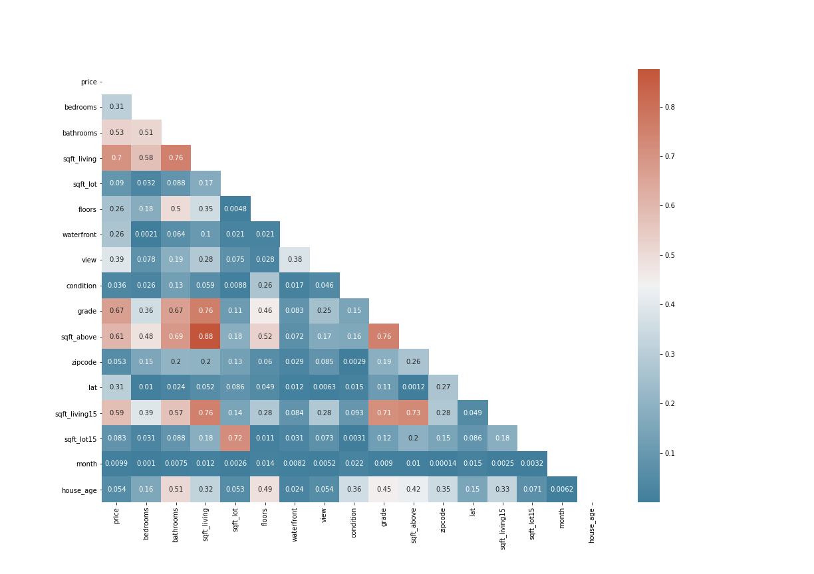

# A King County House Sales Analysis

Author: [TROY STEVE](https://github.com/01Troy)


### Problem:
Picket Partners Realty are new kids in the real estate industry. They want to sell their houses at competative prices and they understand very well that by only doing analysis won't help in this but buy coming up with the best model that will help predict the house prices. We've been tasked to come up with this model using the existing Kings County data. We will use regression modeling to analyze house sales.

### Data
This project uses the King County House Sales dataset. The dataset has features id, date, bedrooms, bathrooms, sqft_living and many others and price as our target. 

### Methods





The data cleaning, processing and exploration was done. Later, regression models were build. 

### Results
The features that affect the price of a house in Kings County are sqft_living, grade,bedrooms, waterfront and sqft_basement.
The p-values of these features were all below 0.05 and our validation score was higher than the test score of the r-squared test.


### Recommendations
The features that affect the price of a house in Kings County are bedrooms, bathrooms, waterfront, grade, zipcode, lat, log_sqft_living, log_sqft_living15.
Those who wish to increase the prices of their houses should consider constructing or adding the square footage of their houses.
In so doing, they should endevour using quality materials in order to increase the grade of the houses. More bedrooms also has a positive relationship with the house prices. 
Location, representated by lat and zipcode also affects the price of a house. It seems houses located in certain places demand higher prices than other places.

### Limitations and Next Steps
Althought our model tries to predict prices in the best way possible, more analysis will be need to be done. This is because we still violated some assumptions even after doing away with some features in order to deal with multicollinearity. We removed the outliers from our price column. This means that our model doesn't predict correctly the extreem prices.

### REPOSITORY STRUCTURE

```bash
├── code
├── data
├── images
├── _index_.ipynb
├── _init_.py
├── README.md
 ```
